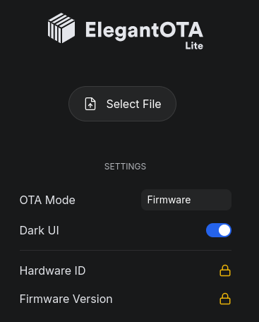
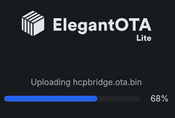
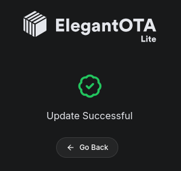
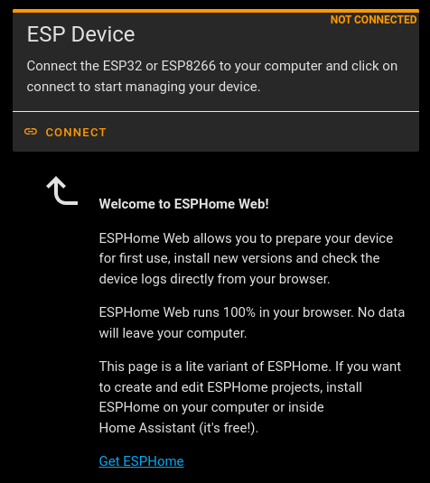
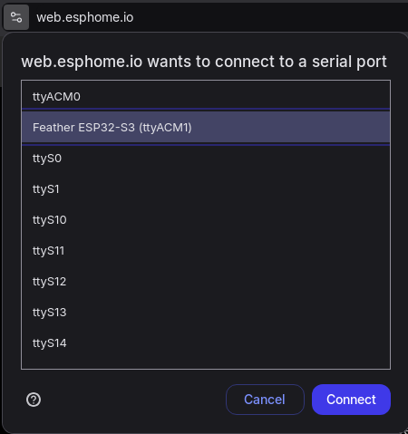
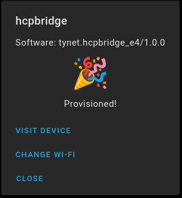

# Getting Started with the ESPHome Firmware

Our boards from tynet.eu ship with the normal Arduino-based firmware that is simple to use out of the box.
Sadly, this firmware, which was developed a few years ago, has some minor inconveniences that are not simple to fix.
If you are one of the few people that have an issue with the firmware or just want to use ESPHome instead, you can follow this guide.

ESPHome uses a native Home Assistant API instead of MQTT and is simple to set up. We also provide configuration files as well as ready to flash .bin files for our boards.

## Advantages over the Arduino-based firmware

- More stable, especially with weak Wi-Fi signals
- External sensors are simpler to add
- More secure due to password protection and optionally an encrypted protocol
- Does NOT require MQTT, as it uses Home Assistant APIs directly
- Binary sensor for the option Relay of the UAP HCP
- The light is implemented as light instead of a switch
- A button for the impulse function
- Half and vent position are available as button or switch depending on your preference
- The vent position is not determined by a hardcoded 4% value, but by the status sent by the motor

## Set up ESPHome in Home Assistant

You can follow the [official guide](https://esphome.io/guides/getting_started_hassio) to install the ESPHome add-on for Home Assistant.

The main steps are:

1. Open your Home Assistant UI
2. Go to Settings -> Add-Ons -> Add-on Store and search for ESPHome
3. Install and activate the ESPHome Device Builder add-on

## Upgrade from the Arduino-based firmware

Our boards all ship with an Arduino-based based firmware, which can be easily upgraded.

1. Download the ESPHome-based firmware file: [hcpbridge.ota.bin](https://github.com/Tysonpower/HCPBridgeMqtt_tynet/raw/refs/heads/main/hcpbridge.ota.bin)
2. Connect the board to power via the USB-C connector and wait a few seconds. The 3V3 LED will be lit.
3. With a phone or a PC, search and connect to the Wi-Fi network called "HCPBRIDGE" created by the PCB.
4. Open the OTA Web UI: [http://192.168.4.1/update](http://192.168.4.1/update)
5. If asked, use the following credentials to login: `user: admin` and `pass: admin`
6. Click "Select File", navigate to the downloaded `hcpbridge.ota.bin` file\
   
7. Wait for the upload to complete\
   \
   

## Board setup

### Using USB (recommended)

1. Ensure your board is connected to your PC over USB-C
2. Open [web.ESPHome.io](https://web.esphome.io), click connect and select the ESP32-S3 device from the list\
   **NOTE**: On Linux, you may have to add yourself to the `dialout` user group (i.e. run `sudo usermod -a -G dialout $USER`)\
   \
   

3. Click the kebab menu (⋮) and select Configure Wi-Fi, select or enter your Wi-Fi name and password
   

4. After entering your Wi-Fi credentials, click connect\
   
5. Upon success, you should see the "Provisioned!" message\
   

### Using Wi-Fi

1. Ensure your board is powered over USB-C
2. Search and connect to the Wi-Fi called `hcpbridge`
3. Open http://192.168.4.1 when connected, login is `user: admin` and `pass: tynet.eu`
4. Connect to your Wi-Fi network over the Web UI
5. Your board should now be connected to your home network over Wi-Fi.

## Add to Home Assistant

Open Home Assistant, go to Devices, here the garage door should be visible under discovered devices, just click "add".


> [!NOTE]
> You can now use the PCB as is and don't need to do the following optional steps.

## Recommended

### Change pre-flashed config

Although the device is now ready to use, it is advisable to take control of the device in ESPHome to ensure that
you can customize the firmware or update Wi-Fi credentials in case of changes to your network infrastructure.

1. Open your Home Assistant UI
2. Go to Settings -> Add-Ons and open the ESPHome addon
3. Click on "Open Web UI"
4. You should now see the discovered device, click "take control". If you like, change the name


> [!NOTE]
> If this process fails, you may have to create some additional secrets, such as `api_key`, `web_username`,
> `web_password` and `hcp_wifi_ap_password` (and in some cases `wifi_ssid` and `wifi_password`) under "Secrets", as they
> are defined in the imported configuration ([esphome.yaml](../esphome.yaml))

5. When it finished uploading, you will see the following log output. If this is the case, you can press close and you 
   are done


### Removing the sensors from the local configuration

If you are not using any of the sensors (e.g. BME280), you can remove this configuration section to produce fewer
warnings and errors.

On the ESPHome UI, click on "Edit" to add the following line to the local configuration:
`sensor: !remove`

A minimal local configuration (i.e. hcpbridge.yaml) could contain the following:
```
packages:
  tynet.hcpbridge_e4: github://Tysonpower/HCPBridgeMqtt_tynet/esphome.yaml@main

# remove sensor section from the imported configuration to avoid related errors/warnings
sensor: !remove
```

## Alternative Setup Procedure

### Set up ESPHome in Home Assistant from scratch

1. Ensure your board is connected to your PC over USB-C
2. Open ESPHome in Home Assistant
3. Click "New Device" and enter a name


4. Click "ESP32-S3"


5. Copy and save the displayed encryption key and click "skip"


6. Click on the secrets button on the top right, create the following keys and enter your Wi-Fi credentials as well as the secret api key you just copied, hit save

    ```
    wifi_ssid: "myWifi"
    wifi_password: "myWifiPassword"
    api_key: "myApiSecretWeCopiedAfewMinutesAgo"
    web_username: "admin"
    web_password: "tynet.eu"
    hcp_wifi_ap_password: "tynet.eu"
    ```

7. Click "edit" on the device card


8. Copy and paste the content of the `ESPHome.yaml` file from this repo into the editor, click "save"


9. Click "install", then select "Manual download", wait for the firmware to be built, select factory format to get the .bin file


10. Then go to [web.ESPHome.io](https://web.esphome.io/), click connect and select your ESP from the device list, click "install", select the .bin file you just downloaded and click "install".
If it doesn't work, try it multiple times


11. Go back to Home Assistant, open Settings -> Devices -> ESPHome. Here, you should be able to add the device, but if not, try to power cycle the board


Click "done" and you can now use the device


