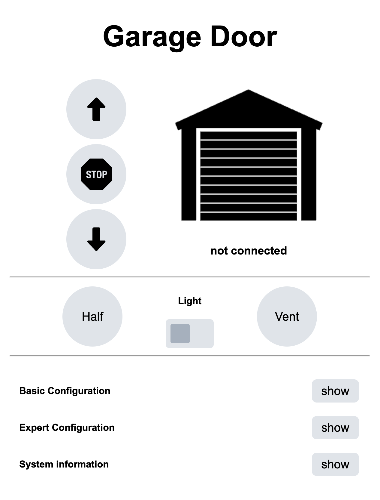
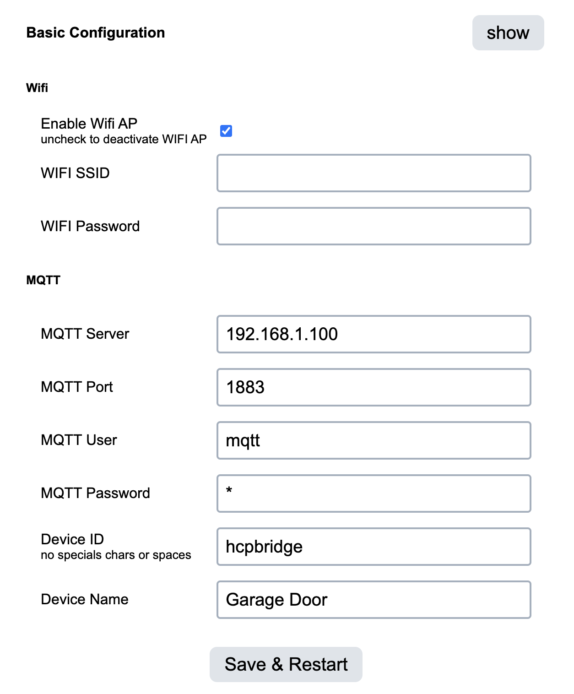

# Getting started with prebuild PCBs

If you bought a prebuild PCB from either Tynet.eu or someone else you can follow this setp by step guide to setup your HCP-Bridge with your Hörmann Garage Door.  

These instructions focus on the tynet.eu PCB version, but it will be really similar with all PCBs.

### Which version of the PCB did you order from tynet.eu?

* [HCPBridge for Series 4](#series-4---preinstalled-firmware-non-esphome)
* [HCPBridge for Supramatic 3](#supramatic-3---preinstalled-firmware-esphome-based)

You want to connect temperature sensors or something else? See our guide: [Connecting sensors on tynet boards](connecting_sensors_prebuild_pcbs.md)

### What you need

* Prebuild PCB with HCPBridge Firmware installed (installed out of the box on tynet.eu PCBs)
* USB-C power supply

----

# Series 4 - preinstalled firmware (non ESPHome)

## Initial configuration

### 1. Connect the PCB to power via the USB-C connector and wait a few seconds. the 3V3 LED will be lit.

### 2. Search and connect to the WIFI Network called "HCPBRIDGE" the PCB creates with a phone or pc.

### 3. When connected, open a webbrowser and go to the WEBUI under the following url : http://192.168.4.1

### 4. Open the "Basic Configuration" tab and enter your WIFI and MQTT credentials, then click save.

> [!NOTE]
> The wifi password has to be ASCII chars between ASCII 32-126.

> [!TIP]
> To disable the wifi AP just uncheck the "Enable wifi AP" checkbox and save

### 5. The PCB should now be connected to your wifi. You can now check if it is reachable from your home network and if it connected to your MQTT Server.

## Installation

### 1. connect the PCB with a RJ12 cable to the BUS port on your Hörmann garage door motor (image below, see green arrow).

   
### 2. Figure out how to execute a bus scan on your model, see info below or have a look in your motors ueer manual.

**ProMatic Serie 4**

Use the bottom dip switch (see image above, blue arrow) and toggle it, this will start the buss can.

**SupraMatic E/P Serie 4**

Use the Buttons to navigate to the menu 37 and excecute the Bus Scan, see here: [Tor7.de - Supramatic Bus Scan](https://www.tor7.de/news/bus-scan-beim-supramatic-serie-4-fehlercode-04-vermeiden)
  
### 3. execute a bus scan on your garage door motor, this should make the PCB light up (3V3) and blink rapidly (RS485 module)
### 4. if the bus scan was succesfully you can connect to the WEBUI and control your garage door motor, it should look like in the image below.

# Supramatic 3 - preinstalled firmware (ESPHome based)

PCBs from tynet.eu for the Supramatic 3 are shipping preinstalled with ESPHome based firmware that is a bit different.

Please follow our ESPHome instructions from the Board Setup step: [ESPHome - getting started](ESPhome_getting_started.md)

> [!NOTE]
> The default login for the WEBUI is user `admin` and password `tynet.eu`

# Supramatic 4 - ESPHome based firmware

PCBs from tynet.eu can be used with the Series 4 ESPHome based firmware as well, just follow our instructions on geting started with ESPHome, this also includes flashing instructions if you want to upgrade from the non ESPHome version.

[ESPHome - getting started](ESPhome_getting_started.md)
